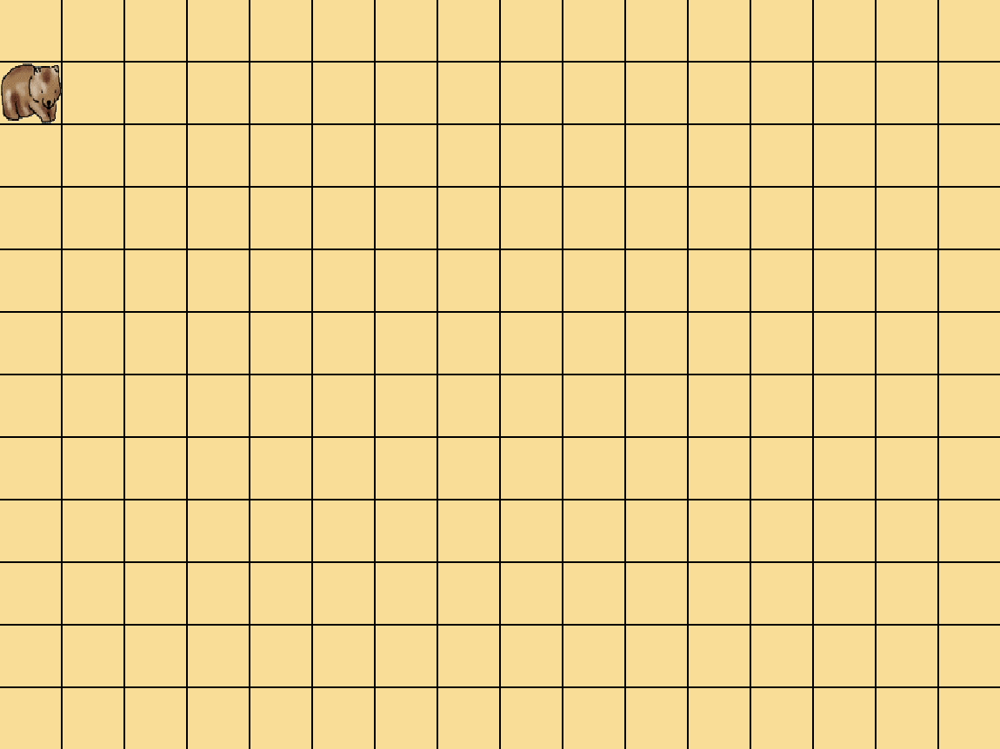

# Day 6

## Topics:

- writing some wombat programs finally
- turn right (together)
- walk forward forever (together)
- walk until can't (together)
- walk around the screen (student)
- walk and place leaf (student)

## Notes:

### making a turn right function:

- if we only have turn lefts, how are we going to do this?

### making the wombat walk forward forever:

### making the wombat walk forward until it can't move:

- using the bob.can_move() function finally

### walk around the screen (student)

### walk and place leaf (student)

- using bob.place_leaf() and bob.walk()

### make a square out of leaves (student) (extra time)

## Homework:

None

